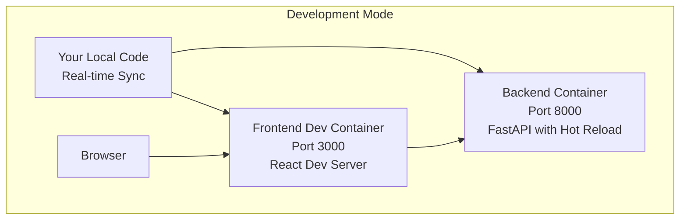
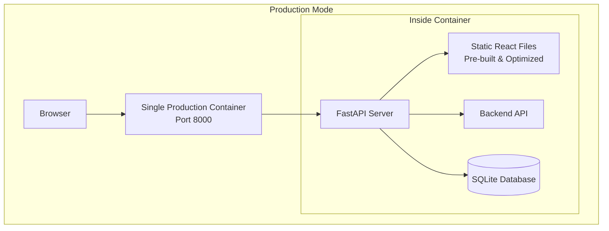
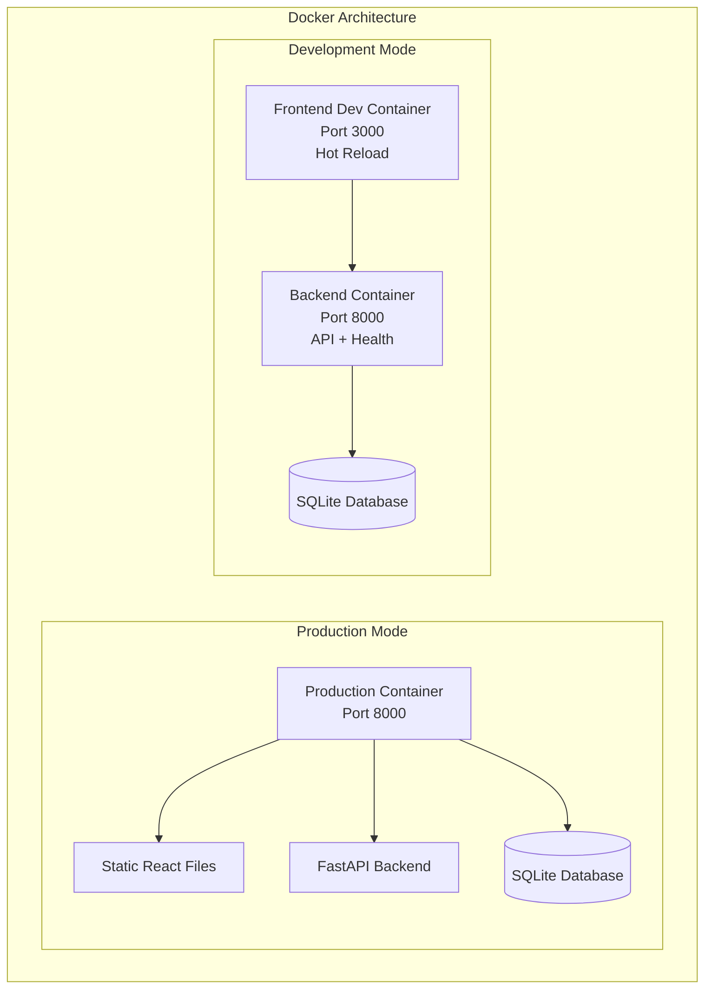

# 🐳 Docker Guide for Beginners

## 📚 What is Docker?

Docker is a **containerization platform** that allows you to package your application and all its dependencies into a lightweight, portable container. Think of a container as a **virtual box** that contains everything needed to run your application.

### 🎯 Why Use Docker?

| Problem Without Docker | Solution With Docker |
|------------------------|---------------------|
| "It works on my machine" | Works the same everywhere |
| Complex setup instructions | One command deployment |
| Different environments | Consistent environment |
| Dependency conflicts | Isolated dependencies |

### 🏗️ Key Docker Concepts

#### 1. **Container** 🚢
- A running instance of your application
- Lightweight, isolated environment
- Contains your app + all dependencies
- Can be started, stopped, and removed

#### 2. **Image** 📦
- A template/blueprint for creating containers
- Contains your application code + operating system + dependencies
- Read-only, immutable
- Can be shared and reused

#### 3. **Dockerfile** 📋
- A text file with instructions to build an image
- Like a recipe that tells Docker how to create your image
- Contains commands like: copy files, install dependencies, set startup command

#### 4. **Docker Compose** 🎼
- Tool for managing multiple containers
- Uses a `compose.yml` file to define services
- Can start/stop multiple containers with one command

---

## 🏗️ How Docker Works in This Project

### 📁 Project Structure
```
FastAPI-React-TypeScript-Chatbot/
├── Dockerfile                 # Instructions to build the main image
├── Dockerfile.frontend-dev    # Instructions for frontend development
├── compose.yml               # Docker Compose configuration
├── .dockerignore            # Files to ignore when building
├── backend/                 # Python FastAPI code
├── frontend/                # React TypeScript code
└── data/                   # Database storage (created automatically)
```

### 🔧 Build Process

When you run Docker commands, here's what happens:

1. **Docker reads Dockerfile** 📖
2. **Downloads base images** (Python, Node.js) 🔽
3. **Copies your code** into the container 📋
4. **Installs dependencies** (pip install, npm install) 📦
5. **Creates final image** ready to run 🎯

---

## 🚀 Development vs Production Modes

### 🛠️ Development Mode

**Purpose**: For coding, testing, and debugging

#### Features:
- ✅ **Hot Reload**: Code changes appear instantly
- ✅ **Source Maps**: Easy debugging with original code
- ✅ **Separate Containers**: Frontend and backend run separately
- ✅ **Volume Mounting**: Your local code is synced with container
- ✅ **Development Tools**: Full development environment

#### How it Works:


#### What You Get:
- **Frontend**: React development server with hot reload
- **Backend**: FastAPI with automatic restart on code changes
- **Debugging**: Full development tools and error messages
- **Speed**: Fast rebuilds and instant feedback

### 🏭 Production Mode

**Purpose**: For deployment and real users

#### Features:
- ✅ **Optimized Build**: Minified, compressed files
- ✅ **Single Container**: Everything runs together efficiently
- ✅ **Static Files**: Pre-built React app served by FastAPI
- ✅ **Performance**: Optimized for speed and resource usage
- ✅ **Security**: No development tools exposed

#### How it Works:


#### What You Get:
- **Frontend**: Optimized React build served as static files
- **Backend**: Production FastAPI server
- **Performance**: Fast loading, minimal resource usage
- **Reliability**: Stable, tested configuration

---

## 🎮 How to Use Development and Production Modes

### 🛠️ Development Mode

#### Step 1: Prerequisites
```bash
# Make sure you have Docker installed
docker --version
docker-compose --version

# Should show:
# Docker version 20.10+
# Docker Compose version 2.0+
```

#### Step 2: Set Up Environment
```bash
# 1. Make sure you're on the docker branch
git checkout docker

# 2. Create environment file
cp .env.example .env

# 3. Edit the .env file with your OpenAI API key
nano .env
# Add: OPENAI_API_KEY=your_actual_openai_api_key_here
```

#### Step 3: Start Development Mode
```bash
# Start development containers
docker-compose --profile dev up -d

# What this command does:
# --profile dev = Only start development services
# up = Start containers
# -d = Run in background (detached)
```

#### Step 4: Access Your Application
```bash
# Frontend (React with hot reload)
open http://localhost:3000

# Backend API
open http://localhost:8000

# API Documentation
open http://localhost:8000/docs
```

#### Step 5: Development Workflow
```bash
# View logs (helpful for debugging)
docker-compose logs -f frontend-dev  # Frontend logs
docker-compose logs -f backend       # Backend logs

# Stop development containers
docker-compose --profile dev down

# Restart after making changes to Docker files
docker-compose --profile dev up -d --build
```

### 🏭 Production Mode

#### Step 1: Build and Start
```bash
# Start production container
docker-compose up -d

# What this does:
# - Builds optimized React app
# - Creates single container with everything
# - Starts on port 8000
```

#### Step 2: Access Production App
```bash
# Everything runs on one port
open http://localhost:8000

# Check if it's working
curl http://localhost:8000/health
# Should return: {"status":"healthy"}
```

#### Step 3: Production Management
```bash
# Check container status
docker-compose ps

# View production logs
docker-compose logs backend

# Stop production
docker-compose down

# Restart with latest changes
docker-compose up -d --build
```

---

## 📋 Common Docker Commands

### 🏃 Starting and Stopping

```bash
# Development Mode
docker-compose --profile dev up -d     # Start dev mode
docker-compose --profile dev down      # Stop dev mode

# Production Mode  
docker-compose up -d                   # Start production
docker-compose down                    # Stop production

# Force rebuild (after code changes)
docker-compose up -d --build           # Rebuild and start
```

### 📊 Monitoring and Debugging

```bash
# Check what's running
docker-compose ps

# View logs
docker-compose logs -f                 # All services
docker-compose logs backend            # Just backend
docker-compose logs frontend-dev       # Just frontend dev

# Enter a running container (for debugging)
docker exec -it container_name /bin/bash

# Check resource usage
docker stats
```

### 🧹 Cleanup

```bash
# Remove containers but keep images
docker-compose down

# Remove containers and volumes (deletes database!)
docker-compose down -v

# Remove unused images and containers
docker system prune

# Nuclear option - remove everything
docker system prune -a
```

---

## 🔧 Configuration Files Explained

### 📄 `compose.yml` - The Orchestrator

```yaml
version: '3.8'

services:
  # Backend service (always runs)
  backend:
    build: .                    # Build from Dockerfile
    ports:
      - "8000:8000"            # Map port 8000
    environment:
      - OPENAI_API_KEY=${OPENAI_API_KEY}  # Pass env vars
    volumes:
      - ./data:/app/data       # Persist database
    healthcheck:               # Monitor container health
      test: ["CMD", "curl", "-f", "http://localhost:8000/health"]

  # Frontend dev service (only in dev mode)
  frontend-dev:
    build:
      context: .
      dockerfile: Dockerfile.frontend-dev
    ports:
      - "3000:3000"           # React dev server port
    volumes:
      - ./frontend:/app       # Mount source code for hot reload
    profiles:
      - dev                   # Only start with --profile dev
    depends_on:
      - backend              # Wait for backend to start
```

### 📄 `Dockerfile` - The Builder

```dockerfile
# Stage 1: Build React app
FROM node:18-alpine as frontend-build
WORKDIR /frontend
COPY frontend/package*.json ./
RUN npm ci --only=production
COPY frontend/ ./
RUN npm run build                    # Create optimized build

# Stage 2: Python backend + React build  
FROM python:3.11-slim as backend
WORKDIR /app
RUN apt-get update && apt-get install -y gcc curl
COPY backend/requirements_sqlite.txt ./
RUN pip install --no-cache-dir -r requirements_sqlite.txt
COPY backend/ ./
COPY --from=frontend-build /frontend/build/ ./static/  # Copy React build
EXPOSE 8000
CMD ["uvicorn", "main_sqlite:app", "--host", "0.0.0.0", "--port", "8000"]
```

---

## 🐛 Troubleshooting Guide

### ❌ Common Problems and Solutions

#### 1. **Port Already in Use**
```bash
# Problem: Port 3000 or 8000 is busy
Error: bind: address already in use

# Solution: Find and kill the process
lsof -ti:3000,8000
kill -9 $(lsof -ti:3000,8000)

# Or use different ports in compose.yml
```

#### 2. **Container Won't Start**
```bash
# Check what went wrong
docker-compose logs backend
docker-compose logs frontend-dev

# Common issues:
# - Missing .env file
# - Invalid OPENAI_API_KEY
# - Permission issues
```

#### 3. **Code Changes Not Reflected**
```bash
# For development mode (should auto-reload):
# - Check if volumes are mounted correctly
# - Restart containers: docker-compose --profile dev restart

# For production mode (requires rebuild):
docker-compose up -d --build
```

#### 4. **Frontend Not Loading**
```bash
# Check if CSS/JS files are accessible:
curl -I http://localhost:8000/static/css/main.xxx.css
curl -I http://localhost:8000/static/js/main.xxx.js

# Should return 200 OK, not 404
```

#### 5. **Database Issues**
```bash
# Reset database (WARNING: deletes all data)
docker-compose down -v
docker-compose up -d

# Or manually delete:
rm -rf ./data
```

### 📝 Environment Variables

Create `.env` file in project root:
```bash
# Required for AI chat functionality
OPENAI_API_KEY=your_actual_openai_api_key_here

# Optional: Database configuration
DATABASE_URL=sqlite:///./data/chatbot.db
```

---

## 🎯 Best Practices

### 🛠️ Development
- ✅ Use development mode for coding and testing
- ✅ Check logs regularly: `docker-compose logs -f`
- ✅ Restart containers after changing Docker files
- ✅ Use `--build` flag after code changes in production mode

### 🏭 Production  
- ✅ Always test in production mode before deploying
- ✅ Monitor container health: `docker-compose ps`
- ✅ Keep your `.env` file secure and never commit it
- ✅ Regular backups of your database: `cp -r ./data ./backup`

### 🔒 Security
- ❌ Never commit `.env` files to git
- ❌ Don't use development mode in production
- ✅ Regularly update base images
- ✅ Use strong, unique API keys

---

## 🚀 Quick Reference

### Development Workflow
```bash
# Start development
git checkout docker
cp .env.example .env
# Edit .env with your API key
docker-compose --profile dev up -d

# Code, test, debug...
# Frontend: http://localhost:3000 (hot reload)
# Backend: http://localhost:8000

# Stop development  
docker-compose --profile dev down
```

### Production Deployment
```bash
# Deploy production
docker-compose up -d --build

# Test application
open http://localhost:8000

# Monitor
docker-compose ps
docker-compose logs backend

# Stop
docker-compose down
```

---

## 📚 Learning Resources

- 🐳 [Docker Official Tutorial](https://www.docker.com/101-tutorial)
- 📖 [Docker Compose Documentation](https://docs.docker.com/compose/)
- 🎬 [Docker for Beginners - YouTube](https://www.youtube.com/watch?v=fqMOX6JJhGo)
- 📝 [Dockerfile Best Practices](https://docs.docker.com/develop/dev-best-practices/)

---

*Happy Dockerizing! 🐳 Start with development mode, experiment, learn, and then move to production when you're ready.*

## 🏗️ Docker Architecture



## 📦 Container Configuration

### Backend Container
- **Base Image**: `python:3.12-slim`
- **Framework**: FastAPI with Uvicorn
- **Dependencies**: Managed via `requirements_sqlite.txt` and pip
- **Database**: SQLite (persistent volume)
- **Health Check**: `/health` endpoint monitoring
- **Ports**: 8000 (HTTP)

### Frontend Container (Production)
- **Build Stage**: Node.js for React build
- **Runtime**: Served via FastAPI static files
- **Optimization**: Multi-stage build for minimal image size

### Frontend Container (Development)
- **Base Image**: `node:18-alpine`
- **Features**: Hot reload, source maps, development server
- **Ports**: 3000 (HTTP)
- **Volume**: Source code mounted for live updates

## 🚀 Quick Start

### 1. Prerequisites
```bash
# Verify Docker installation
docker --version
docker-compose --version

# Should show:
# Docker version 20.10+ 
# Docker Compose version 2.0+
```

### 2. Environment Setup
```bash
# Clone and switch to docker branch
git checkout docker

# Copy environment template
cp .env.example .env

# Edit with your OpenAI API key
nano .env
```

### 3. Launch Application

#### Production Mode
```bash
# Start all services in production mode
docker-compose up -d

# Access application
open http://localhost:8000
```

#### Development Mode  
```bash
# Start with development profile for hot reload
docker-compose --profile dev up -d

# Access development server
open http://localhost:3000
# Backend API still available at http://localhost:8000
```

## 🛠️ Docker Compose Configuration

### Services Overview

| Service | Mode | Port | Description |
|---------|------|------|-------------|
| `backend` | Always | 8000 | FastAPI + Static Files |
| `frontend-dev` | Dev Only | 3000 | React Dev Server |

### Profiles

- **Default**: Production mode with integrated frontend
- **Development**: Separate frontend container with hot reload

### Environment Variables

```yaml
# .env file configuration
OPENAI_API_KEY=your_actual_openai_api_key_here
```

## 📋 Docker Commands Reference

### Basic Operations
```bash
# Start services
docker-compose up -d

# Stop services  
docker-compose down

# View service status
docker-compose ps

# View logs
docker-compose logs -f
docker-compose logs backend
docker-compose logs frontend-dev
```

### Development Workflow
```bash
# Start development mode
docker-compose --profile dev up -d

# Rebuild after code changes
docker-compose up -d --build

# Follow logs in real-time
docker-compose logs -f frontend-dev
```

### Maintenance
```bash
# Remove containers and volumes
docker-compose down -v

# Clean up unused images
docker system prune

# Rebuild from scratch
docker-compose build --no-cache
docker-compose up -d
```

## 🔧 Container Health Monitoring

### Health Checks

**Backend Health Check:**
- **Endpoint**: `GET /health`
- **Interval**: 30 seconds
- **Timeout**: 10 seconds
- **Retries**: 3

```bash
# Check container health
docker-compose ps

# Should show "healthy" status for backend
```

**Manual Health Verification:**
```bash
# Backend API health
curl http://localhost:8000/health

# Frontend (development)
curl http://localhost:3000

# API documentation
open http://localhost:8000/docs
```

## 🐛 Troubleshooting

### Common Issues

#### 1. Port Conflicts
```bash
# Check port usage
lsof -ti:3000,8000

# Kill processes using ports
kill -9 $(lsof -ti:3000,8000)
```

#### 2. Environment Variables Not Loading
```bash
# Verify .env file exists and has correct format
cat .env

# Restart containers to reload environment
docker-compose down
docker-compose up -d
```

#### 3. Frontend Not Building
```bash
# Check frontend-dev logs
docker-compose logs frontend-dev

# Common solutions:
# - Ensure Node.js dependencies are installed
# - Check for TypeScript errors
# - Verify source code mounting
```

#### 4. Backend Database Issues
```bash
# Check backend logs
docker-compose logs backend

# Reset database (removes all data)
docker-compose down -v
docker-compose up -d
```

#### 5. Container Build Failures
```bash
# Rebuild without cache
docker-compose build --no-cache

# Check Dockerfile syntax
docker build -t test-build .
```

### Log Analysis

```bash
# View specific service logs
docker-compose logs backend --tail=50
docker-compose logs frontend-dev --tail=50

# Follow logs in real-time
docker-compose logs -f --tail=100

# Export logs to file
docker-compose logs > application.log
```

## 🔒 Security Considerations

### Production Deployment
- **Environment Variables**: Use secure secret management
- **Network**: Configure proper firewall rules
- **Volumes**: Secure database file permissions
- **Images**: Regularly update base images

### Development Safety
- **API Keys**: Never commit `.env` files
- **Ports**: Limit exposure to localhost only
- **Volumes**: Review mounted directories

## 🚀 Performance Optimization

### Image Size Optimization
- **Multi-stage builds**: Separate build and runtime stages
- **Alpine images**: Smaller base images where possible
- **.dockerignore**: Exclude unnecessary files

### Runtime Performance
- **Resource limits**: Configure memory/CPU limits in production
- **Health checks**: Monitor service availability
- **Logging**: Configure appropriate log levels

## 📊 Monitoring and Metrics

### Container Metrics
```bash
# View resource usage
docker stats

# Specific container stats
docker stats fastapi-react-typescript-chatbot-backend-1
```

### Application Metrics
```bash
# Backend API response time
curl -w "@curl-format.txt" -o /dev/null -s http://localhost:8000/health

# Frontend build time
docker-compose logs frontend-dev | grep "compiled"
```

## 🔄 CI/CD Integration

### GitHub Actions Example
```yaml
name: Docker Build
on: [push]
jobs:
  docker:
    runs-on: ubuntu-latest
    steps:
      - uses: actions/checkout@v3
      - name: Build and test
        run: |
          docker-compose build
          docker-compose up -d
          # Add tests here
          docker-compose down
```

## 📚 Additional Resources

- [Docker Documentation](https://docs.docker.com/)
- [Docker Compose Reference](https://docs.docker.com/compose/)
- [FastAPI Docker Guide](https://fastapi.tiangolo.com/deployment/docker/)
- [React Docker Best Practices](https://create-react-app.dev/docs/deployment/#docker)

---

For more information, see the main [README.md](./readme.md) or specific documentation:
- [Backend Documentation](./backend.md)
- [Frontend Documentation](./frontend.md)
- [Full Stack Architecture](./fullstack.md)
