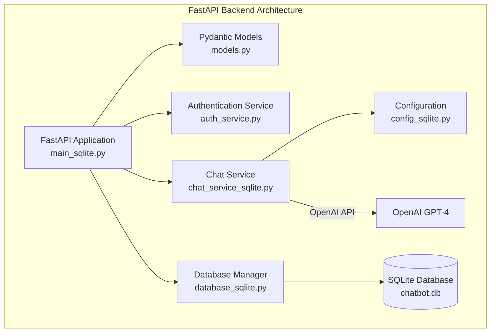
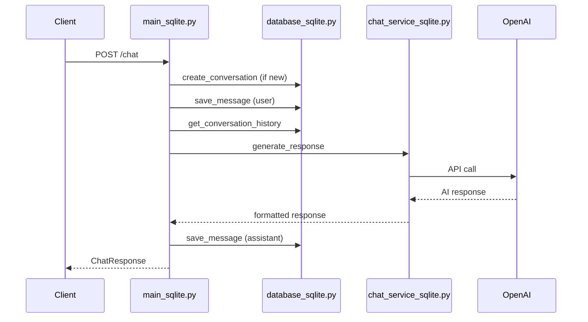

# 🚀 FastAPI Backend Documentation

## Overview

This is a FastAPI-based backend for an AI chatbot application that uses SQLite for data persistence and OpenAI's GPT API for chat responses. The backend provides a comprehensive RESTful API for managing conversations and processing chat messages with clean Python dependency management using pip and virtual environments.

## ✨ Key Features

- 🤖 **AI Chat Responses** - OpenAI GPT integration
- 🔐 **User Authentication** - JWT-based secure authentication
- 📚 **Conversation Management** - Persistent chat history
- 🗄️ **SQLite Database** - Lightweight, file-based storage
- � **Virtual Environment** - Clean Python dependency management with pip
- 🐳 **Docker Support** - Full containerization with health checks
- 📊 **Static File Serving** - Integrated React app serving
- 🏥 **Health Monitoring** - Built-in health check endpoints

## 🏗️ Architecture



## 📦 Dependencies & Setup

### Python Requirements (requirements_sqlite.txt)
The backend uses a virtual environment with pip for dependency management:

```txt
fastapi==0.104.1
uvicorn==0.24.0
openai==1.3.7
python-dotenv==1.0.0
pydantic==2.9.2
python-multipart==0.0.6
passlib==1.7.4
python-jose==3.3.0
bcrypt==4.0.1
requests==2.32.4
```

### Environment Variables
Create a `.env` file based on `.env.example`:
```bash
# OpenAI API Key for chat completions
OPENAI_API_KEY=your_openai_api_key_here

# JWT Secret Key for authentication
JWT_SECRET_KEY=your_secure_random_string_here

# Database configuration
DATABASE_URL=sqlite:///chatbot.db
```

## Core Components

### 1. FastAPI Application (`main_sqlite.py`)

The main application entry point that defines all API endpoints and handles HTTP requests.

#### Key Features:
- **CORS Middleware**: Allows requests from React frontend (localhost:3000)
- **Static File Serving**: Serves React production build from `/static` and root `/`
- **Health Endpoints**: `/health` and `/api` for monitoring
- **Error Handling**: Comprehensive exception handling with proper HTTP status codes
- **Logging**: Structured logging for debugging and monitoring
- **Lifecycle Events**: Database connection management on startup/shutdown
- **Docker Support**: Containerized deployment with health checks

#### API Endpoints:

| Method | Endpoint | Description |
|--------|----------|-------------|
| `GET` | `/` | Serves React app (index.html) |
| `GET` | `/health` | Health check endpoint |
| `GET` | `/api` | API status endpoint |
| `GET` | `/static/{path}` | Serves static files (CSS, JS, images) |
| `POST` | `/chat` | Send message and get AI response |
| `POST` | `/conversations` | Create new conversation |
| `GET` | `/conversations/{id}/messages` | Get conversation messages |
| `GET` | `/conversations/user/{user_id}` | Get user's conversations |
| `GET` | `/conversations/{id}/full` | Get conversation with messages |
| `DELETE` | `/conversations/{id}` | Delete conversation |

#### Request/Response Flow:


### 2. Data Models (`models.py`)

Pydantic models that define the data structure and validation for API requests and responses.

#### Models:

```python
# Request Models
class ChatRequest(BaseModel):
    message: str
    conversation_id: Optional[int] = None
    user_id: str = "default_user"

class ConversationCreate(BaseModel):
    user_id: str

# Response Models
class ChatResponse(BaseModel):
    response: str
    conversation_id: int

class ConversationResponse(BaseModel):
    id: int
    user_id: str
```

#### Benefits:
- **Type Safety**: Automatic validation and type checking
- **Documentation**: Auto-generated API documentation
- **Serialization**: Automatic JSON serialization/deserialization

### 3. Database Manager (`database_sqlite.py`)

Handles all database operations with SQLite, providing a clean abstraction layer.

#### Database Schema:

```sql
-- Conversations table
CREATE TABLE conversations (
    id INTEGER PRIMARY KEY AUTOINCREMENT,
    user_id TEXT NOT NULL,
    created_at TIMESTAMP DEFAULT CURRENT_TIMESTAMP
);

-- Messages table
CREATE TABLE messages (
    id INTEGER PRIMARY KEY AUTOINCREMENT,
    conversation_id INTEGER,
    role TEXT NOT NULL CHECK (role IN ('user', 'assistant')),
    content TEXT NOT NULL,
    created_at TIMESTAMP DEFAULT CURRENT_TIMESTAMP,
    FOREIGN KEY (conversation_id) REFERENCES conversations(id)
);
```

#### Key Methods:

| Method | Purpose |
|--------|---------|
| `connect()` | Establish database connection and create tables |
| `create_conversation()` | Create new conversation for user |
| `save_message()` | Store user or assistant message |
| `get_conversation_history()` | Retrieve message history |
| `get_all_conversations()` | Get user's conversation list with metadata |
| `delete_conversation()` | Remove conversation and all messages |

#### Features:
- **Connection Management**: Proper connection lifecycle
- **Error Handling**: Graceful error handling with logging
- **Data Integrity**: Foreign key constraints and data validation
- **Optimized Queries**: Efficient SQL with proper indexing

### 4. Chat Service (`chat_service_sqlite.py`)

Handles AI response generation using OpenAI's GPT-3.5-turbo model.

#### Features:
- **OpenAI Integration**: Direct API calls to GPT-3.5-turbo
- **Message Formatting**: Converts database format to OpenAI format
- **Error Handling**: Fallback responses for API failures
- **Configurable Parameters**: Model settings (temperature, max_tokens)

#### Message Flow:
```python
# Input: SQLite tuples [(role, content), ...]
messages = [("user", "Hello"), ("assistant", "Hi there!")]

# Formatted for OpenAI API
formatted = [
    {"role": "system", "content": "You are a helpful assistant chatbot."},
    {"role": "user", "content": "Hello"},
    {"role": "assistant", "content": "Hi there!"}
]
```

### 5. Configuration (`config_sqlite.py`)

Manages environment variables and application settings.

#### Settings:
- **OpenAI API Key**: Loaded from `.env` file
- **Database URL**: SQLite database path
- **Environment Variables**: Secure configuration management

## Data Flow

### 1. User Sends Message
```
Frontend → POST /chat → FastAPI → Database (save user message)
```

### 2. AI Response Generation
```
FastAPI → Database (get history) → Chat Service → OpenAI API → AI Response
```

### 3. Response Storage and Return
```
AI Response → Database (save assistant message) → FastAPI → Frontend
```

## Error Handling

### HTTP Status Codes:
- **200**: Success
- **404**: Conversation not found
- **500**: Internal server error

### Error Response Format:
```json
{
    "detail": "Error description"
}
```

### Logging Levels:
- **INFO**: Normal operations, connections
- **ERROR**: Exceptions, API failures
- **WARNING**: Non-critical issues

## Security Features

### 1. CORS Configuration
```python
allow_origins=["http://localhost:3000"]  # Restrict to frontend
allow_credentials=True
allow_methods=["*"]
allow_headers=["*"]
```

### 2. Environment Variables
- API keys stored in `.env` file (not committed to git)
- Database path configurable
- Secure credential management

### 3. SQL Injection Prevention
- Parameterized queries
- SQLite driver built-in protection
- Input validation through Pydantic

## Performance Considerations

### Database Optimizations:
- **Indexes**: Primary keys for fast lookups
- **Connection Reuse**: Single connection with thread safety
- **Efficient Queries**: Optimized SQL with proper joins

### API Optimizations:
- **Async Support**: FastAPI async capabilities
- **Response Models**: Efficient JSON serialization
- **Error Caching**: Graceful degradation

## 🐳 Docker Deployment

### Container Configuration
```dockerfile
FROM python:3.12-slim
WORKDIR /app
COPY backend/ .
RUN pip install -r requirements_sqlite.txt
HEALTHCHECK --interval=30s --timeout=10s --start-period=5s --retries=3 \
  CMD curl -f http://localhost:8000/health || exit 1
EXPOSE 8000
CMD ["python", "main_sqlite.py"]
```

### Health Check Implementation
```python
@app.get("/health")
async def health_check():
    return {
        "status": "healthy",
        "timestamp": datetime.now().isoformat(),
        "database": "connected"
    }
```

### Docker Compose Integration
- **Production Mode**: Serves React build files via FastAPI
- **Development Mode**: Separate backend container for API only
- **Persistent Volume**: SQLite database mounted for data persistence
- **Health Monitoring**: Built-in health checks for container orchestration

## Development Setup

### 1. Environment Variables (`.env`):
```bash
OPENAI_API_KEY=your_openai_api_key_here
DATABASE_URL=chatbot.db
```

### 2. Dependencies (`requirements_sqlite.txt`):
```
fastapi
uvicorn
openai
python-dotenv
pydantic
python-multipart
passlib
python-jose
bcrypt
requests
```

### 3. Running the Server:

#### Local Development:
```bash
# Create and activate virtual environment
cd backend
python -m venv .venv
source .venv/bin/activate  # On Windows: .venv\Scripts\activate

# Install dependencies
pip install -r requirements_sqlite.txt

# Run development server
uvicorn main_sqlite:app --reload --port 8000

# Or direct execution
python main_sqlite.py
```

#### Docker Development:
```bash
# Build and run container
docker build -t chatbot-backend .
docker run -p 8000:8000 -e OPENAI_API_KEY=your_key chatbot-backend

# Using Docker Compose
docker-compose up backend
```

## API Documentation

FastAPI automatically generates interactive API documentation:

- **Swagger UI**: `http://localhost:8000/docs`
- **ReDoc**: `http://localhost:8000/redoc`
- **OpenAPI Schema**: `http://localhost:8000/openapi.json`

## Database Management

### Initial Setup:
- Tables created automatically on first connection
- No manual database setup required

### Data Persistence:
- All data stored in `chatbot.db` file
- Conversation history preserved between sessions
- User data linked by `user_id`

## Monitoring and Debugging

### Logging:
```python
# Log levels and format
logging.basicConfig(level=logging.INFO)
logger = logging.getLogger(__name__)
```

### Health Check:
```bash
# Local development
curl http://localhost:8000/health

# Docker container
curl http://localhost:8000/health

# Expected response:
{
  "status": "healthy",
  "timestamp": "2025-08-15T10:30:00",
  "database": "connected"
}

# API status
curl http://localhost:8000/api
# Response: {"message": "API is running", "version": "1.0.0"}
```

## Scalability Considerations

### Current Limitations:
- SQLite single-writer limitation
- In-memory OpenAI client
- Local file storage

### Future Improvements:
- PostgreSQL for better concurrency
- Redis for caching
- Load balancing for multiple instances
- Message queues for async processing

## Testing

### Unit Tests:
- Database operations
- API endpoints
- Error handling
- Model validation

### Integration Tests:
- End-to-end conversation flow
- Database consistency
- OpenAI API integration
