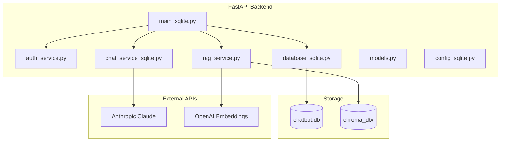

# Backend Documentation

FastAPI backend for the AI chatbot. Handles authentication, conversation storage, Claude AI responses, and RAG (Retrieval-Augmented Generation) via ChromaDB.

## Architecture


```mermaid
graph TB
    subgraph "FastAPI Backend"
        API[main_sqlite.py]
        AUTH[auth_service.py]
        CHAT[chat_service_sqlite.py]
        RAG[rag_service.py]
        DB[database_sqlite.py]
        MODELS[models.py]
        CONFIG[config_sqlite.py]
    end

    subgraph "Storage"
        SQLITE[(chatbot.db)]
        CHROMA[(chroma_db/)]
    end

    subgraph "External APIs"
        CLAUDE[Anthropic Claude]
        OPENAI[OpenAI Embeddings]
    end

    API --> AUTH
    API --> CHAT
    API --> RAG
    API --> DB
    DB --> SQLITE
    RAG --> CHROMA
    CHAT --> CLAUDE
    RAG --> OPENAI
```

## Modules

### `main_sqlite.py` — API entry point
All HTTP endpoints, CORS middleware, lifecycle events (DB connect/disconnect).

### `auth_service.py` — Authentication
- `register_user()` — hash password with bcrypt, insert user
- `authenticate_user()` — verify password, return JWT
- `get_current_user()` — decode JWT, return UserResponse

### `chat_service_sqlite.py` — Claude integration
Formats conversation history and calls Anthropic Claude. RAG context is injected into the system prompt when relevant chunks are found.

### `rag_service.py` — RAG layer
| Function / Method | Purpose |
|-------------------|---------|
| `chunk_text(text)` | Split text into 800-char overlapping chunks |
| `extract_pdf_text(bytes)` | Parse PDF via pypdf |
| `extract_url_text(url)` | Fetch URL with requests, strip HTML with BeautifulSoup |
| `RagService.add_document()` | Embed chunks with OpenAI, store in ChromaDB |
| `RagService.query()` | Semantic search across user + global collections |
| `RagService.delete_document()` | Remove chunks from ChromaDB by doc_id |

### `database_sqlite.py` — SQLite CRUD
Tables: `users`, `conversations`, `messages`, `documents`.

### `models.py` — Pydantic models
| Model | Used for |
|-------|---------|
| `UserCreate` | POST /auth/register |
| `UserLogin` | POST /auth/login |
| `UserResponse` | Auth responses |
| `LoginResponse` | Login response with JWT |
| `ChatRequest` | POST /chat |
| `ChatResponse` | Chat response |
| `UrlIngestRequest` | POST /documents/upload-url |

## API Endpoints

### Auth
```
POST /auth/register   body: {username, email, password}
POST /auth/login      body: {username, password}  → {access_token, user}
GET  /auth/me         header: Authorization: Bearer <token>
```

### Chat
```
POST /chat   body: {message, conversation_id?}   header: Bearer token
```

### Conversations
```
GET    /conversations           header: Bearer token
GET    /conversations/{id}/full header: Bearer token
DELETE /conversations/{id}      header: Bearer token
```

### Documents (RAG)
```
POST   /documents/upload      multipart: file, is_global   header: Bearer token
POST   /documents/upload-url  body: {url, is_global}       header: Bearer token
GET    /documents                                           header: Bearer token
DELETE /documents/{id}                                     header: Bearer token
```

## Database Schema

```sql
CREATE TABLE users (
    id INTEGER PRIMARY KEY AUTOINCREMENT,
    username TEXT UNIQUE NOT NULL,
    email TEXT UNIQUE NOT NULL,
    password_hash TEXT NOT NULL,
    created_at TIMESTAMP DEFAULT CURRENT_TIMESTAMP
);

CREATE TABLE conversations (
    id INTEGER PRIMARY KEY AUTOINCREMENT,
    user_id INTEGER NOT NULL,
    created_at TIMESTAMP DEFAULT CURRENT_TIMESTAMP,
    FOREIGN KEY (user_id) REFERENCES users(id)
);

CREATE TABLE messages (
    id INTEGER PRIMARY KEY AUTOINCREMENT,
    conversation_id INTEGER,
    role TEXT NOT NULL CHECK (role IN ('user', 'assistant')),
    content TEXT NOT NULL,
    created_at TIMESTAMP DEFAULT CURRENT_TIMESTAMP,
    FOREIGN KEY (conversation_id) REFERENCES conversations(id)
);

CREATE TABLE documents (
    id INTEGER PRIMARY KEY AUTOINCREMENT,
    user_id INTEGER NOT NULL,
    filename TEXT NOT NULL,
    file_type TEXT NOT NULL,   -- 'pdf', 'txt', or 'url'
    chunk_count INTEGER DEFAULT 0,
    is_global INTEGER DEFAULT 0,
    created_at TIMESTAMP DEFAULT CURRENT_TIMESTAMP,
    FOREIGN KEY (user_id) REFERENCES users(id)
);
```

## Environment Variables

```env
ANTHROPIC_API_KEY=          # Required for Claude chat
OPENAI_API_KEY=             # Required for RAG embeddings
SECRET_KEY=                 # JWT signing key
ACCESS_TOKEN_EXPIRE_MINUTES=30
```

## Setup

```bash
# Option A: pip
pip install -r requirements_sqlite.txt
uvicorn main_sqlite:app --reload --port 8000

# Option B: Poetry
poetry install
poetry run uvicorn main_sqlite:app --reload --port 8000

# Option C: Docker
docker-compose up --build
```

## Testing

```bash
pytest test/ -v
# 49 tests: auth, chat, conversations, RAG (file + URL)
```

## API Docs (auto-generated)

- Swagger UI: http://localhost:8000/docs
- ReDoc: http://localhost:8000/redoc
