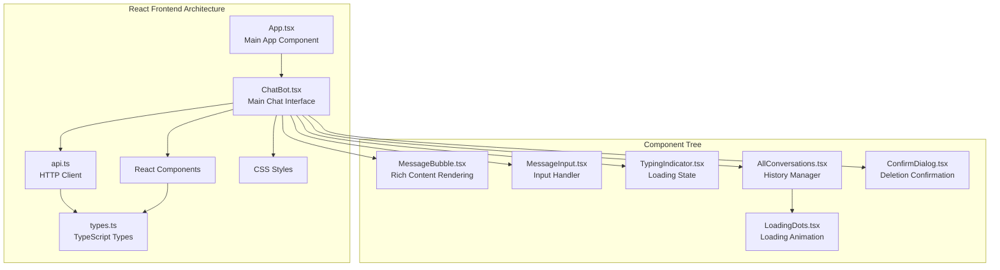
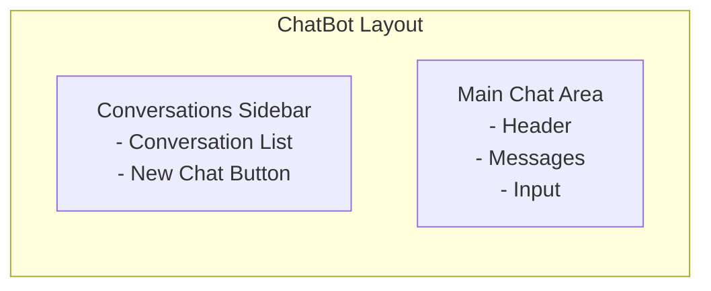
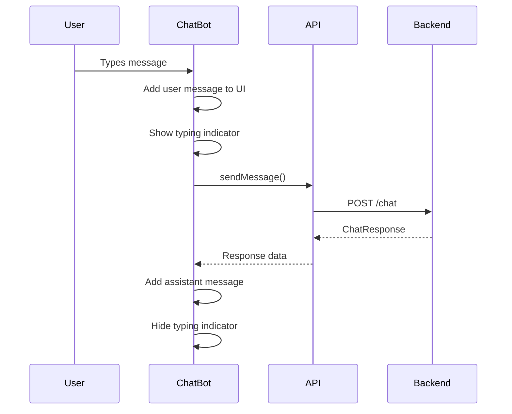
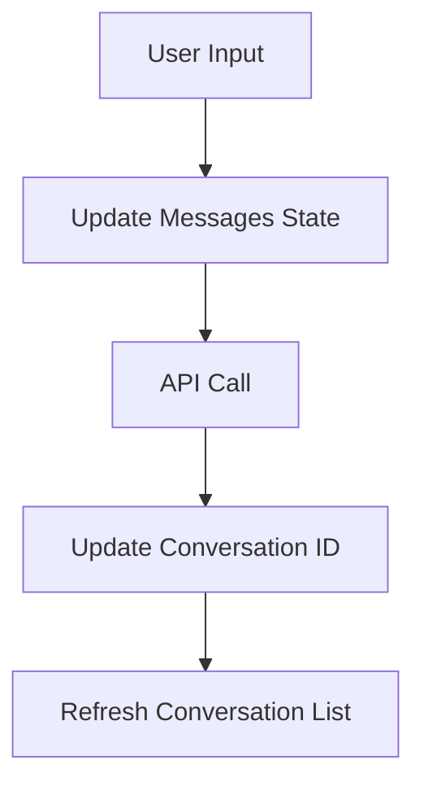

# ⚛️ React TypeScript Frontend Documentation

## Overview

This is a modern React frontend built with TypeScript for a chatbot application. It provides an intuitive chat interface with conversation management, real-time messaging, rich content rendering (tables, code, equations), and seamless integration with the FastAPI backend.

## 🏗️ Architecture



## 📦 Dependencies

### Core Dependencies
```json
{
  "react": "^19.1.1",
  "react-dom": "^19.1.1", 
  "typescript": "^4.9.5",
  "react-markdown": "^9.0.1",
  "react-syntax-highlighter": "^15.6.1",
  "katex": "^0.16.22",
  "rehype-katex": "^7.0.0",
  "remark-gfm": "^4.0.0",
  "remark-math": "^6.0.0"
}
```

### Rich Content Features
- **Tables**: GitHub Flavored Markdown support via `remark-gfm`
- **Code Blocks**: Syntax highlighting with `react-syntax-highlighter`
- **Math Equations**: LaTeX rendering with `katex` and `rehype-katex`

## Core Components

### 1. App Component (`App.tsx`)

The root component that renders the main chatbot interface.

```tsx
function App() {
  return (
    <div className="App">
      <ChatBot />
    </div>
  );
}
```

#### Features:
- **Simple Structure**: Clean, minimal root component
- **CSS Integration**: Imports global styles
- **Single Responsibility**: Only renders the main chat interface

### 2. ChatBot Component (`ChatBot.tsx`)

The main chat interface that manages conversation state and user interactions.

#### State Management:
```tsx
const [messages, setMessages] = useState<Message[]>([]);
const [isLoading, setIsLoading] = useState(false);
const [conversationId, setConversationId] = useState<number | null>(null);
const [isTyping, setIsTyping] = useState(false);
const [userId] = useState('user-123');
const [refreshTrigger, setRefreshTrigger] = useState(0);
```

#### Key Features:

| Feature | Description |
|---------|-------------|
| **Real-time Messaging** | Immediate UI updates for user messages |
| **Conversation Management** | Create, select, and delete conversations |
| **Auto-scroll** | Automatically scrolls to latest message |
| **Loading States** | Visual feedback during API calls |
| **Error Handling** | Graceful error messages and fallbacks |
| **Welcome Screen** | Helpful introduction for new users |

#### Layout Structure:


#### Message Flow:


### 3. API Client (`api.ts`)

HTTP client that handles all backend communication using the Fetch API.

#### API Methods:

| Method | Endpoint | Purpose |
|--------|----------|---------|
| `sendMessage()` | `POST /chat` | Send user message and get AI response |
| `getUserConversations()` | `GET /conversations/user/{id}` | Get user's conversation list |
| `getFullConversation()` | `GET /conversations/{id}/full` | Load complete conversation with messages |
| `createConversation()` | `POST /conversations` | Create new conversation |
| `deleteConversation()` | `DELETE /conversations/{id}` | Delete conversation |

#### Error Handling:
```tsx
async sendMessage(request: ChatRequest): Promise<ChatResponse> {
  const response = await fetch(`${API_BASE_URL}/chat`, {
    method: 'POST',
    headers: { 'Content-Type': 'application/json' },
    body: JSON.stringify(request),
  });

  if (!response.ok) {
    throw new Error('Failed to send message');
  }

  return response.json();
}
```

#### Features:
- **Type Safety**: Full TypeScript integration
- **Error Handling**: Proper exception throwing
- **JSON Serialization**: Automatic request/response handling
- **RESTful Design**: Clean API endpoint structure

### 4. TypeScript Types (`types.ts`)

Comprehensive type definitions ensuring type safety across the application.

#### Core Interfaces:

```typescript
interface Message {
  id?: number;
  role: 'user' | 'assistant';
  content: string;
  conversation_id?: number;
  created_at?: string;
}

interface ChatRequest {
  message: string;
  conversation_id?: number;
  user_id?: string;
}

interface ConversationSummary {
  id: number;
  user_id: string;
  created_at: string;
  message_count: number;
  last_message_at: string | null;
  preview: string;
}
```

#### Benefits:
- **Type Safety**: Compile-time error detection
- **IntelliSense**: Better IDE support and autocomplete
- **Documentation**: Self-documenting code
- **Refactoring Safety**: Easier code maintenance

### 5. Component Details

#### MessageBubble (`MessageBubble.tsx`)

Renders individual chat messages with proper styling and avatars.

```tsx
const MessageBubble: React.FC<MessageBubbleProps> = ({ message }) => {
  const isUser = message.role === 'user';
  
  return (
    <div className={`message-bubble ${isUser ? 'user' : 'assistant'}`}>
      {!isUser && <div className="message-avatar assistant-avatar">🤖</div>}
      <div className={`message-content ${isUser ? 'user' : 'assistant'}`}>
        <p>{message.content}</p>
      </div>
      {isUser && <div className="message-avatar user-avatar">👤</div>}
    </div>
  );
};
```

**Features:**
- **Role-based Styling**: Different appearance for user vs assistant
- **Avatar Display**: Visual distinction with emojis
- **Responsive Design**: Adapts to different screen sizes

#### MessageInput (`MessageInput.tsx`)

Advanced input component with auto-resize and keyboard shortcuts.

**Features:**
- **Auto-resize Textarea**: Grows with content
- **Keyboard Shortcuts**: Enter to send, Shift+Enter for new line
- **Loading States**: Disabled during API calls
- **Form Validation**: Prevents empty message submission

```tsx
const handleKeyPress = (e: React.KeyboardEvent) => {
  if (e.key === 'Enter' && !e.shiftKey) {
    e.preventDefault();
    handleSubmit(e);
  }
};
```

#### AllConversations (`AllConversations.tsx`)

Sophisticated conversation management component.

**Features:**
- **Auto-refresh**: Updates conversation list every 30 seconds
- **Delete Functionality**: Confirmation dialog for safety
- **Active State**: Highlights current conversation
- **Loading States**: Shows loading indicators
- **Error Handling**: Graceful error display

**Auto-refresh Logic:**
```tsx
useEffect(() => {
  const interval = setInterval(() => {
    loadConversations(true); // Auto-refresh
  }, 30000);
  
  return () => clearInterval(interval);
}, [userId]);
```

#### TypingIndicator (`TypingIndicator.tsx`)

Animated typing indicator for better user experience.

**Features:**
- **CSS Animations**: Smooth dot animation
- **Conditional Rendering**: Shows only when AI is typing
- **Visual Feedback**: Clear indication of processing state

## State Management

### Local Component State

The application uses React's built-in `useState` and `useEffect` hooks for state management.

#### ChatBot State:
```tsx
// Message history
const [messages, setMessages] = useState<Message[]>([]);

// UI states
const [isLoading, setIsLoading] = useState(false);
const [isTyping, setIsTyping] = useState(false);

// Conversation tracking
const [conversationId, setConversationId] = useState<number | null>(null);

// User identification
const [userId] = useState('user-123');
```

#### State Flow:


### Side Effects Management

#### Auto-scroll Implementation:
```tsx
const messagesEndRef = useRef<HTMLDivElement>(null);

const scrollToBottom = () => {
  messagesEndRef.current?.scrollIntoView({ behavior: 'smooth' });
};

useEffect(() => {
  scrollToBottom();
}, [messages, isTyping]);
```

#### Conversation Refresh:
```tsx
useEffect(() => {
  if (refreshTrigger && refreshTrigger > 0) {
    loadConversations();
  }
}, [refreshTrigger]);
```

## User Experience Features

### 1. Real-time Feedback
- **Immediate UI Updates**: User messages appear instantly
- **Typing Indicators**: Shows when AI is processing
- **Loading States**: Clear indication of ongoing operations

### 2. Conversation Management
- **Conversation History**: Persistent conversation list
- **Easy Navigation**: Click to switch between conversations
- **Safe Deletion**: Confirmation dialogs prevent accidents

### 3. Responsive Design
- **Mobile-friendly**: Works on various screen sizes
- **Auto-resize Input**: Adapts to content length
- **Smooth Animations**: Enhanced visual experience

### 4. Error Handling
- **Graceful Degradation**: Fallback messages for errors
- **User Feedback**: Clear error messages
- **Retry Mechanisms**: Users can retry failed operations

## Performance Optimizations

### 1. Efficient Rendering
```tsx
// Optimized message rendering
{messages.map((message, index) => (
  <MessageBubble key={index} message={message} />
))}
```

### 2. Auto-refresh Strategy
- **Background Updates**: Non-intrusive conversation list updates
- **Debounced Refreshes**: Prevents excessive API calls
- **Conditional Loading**: Different indicators for auto vs manual refresh

### 3. Memory Management
- **Cleanup Effects**: Proper cleanup of intervals and timeouts
- **Optimized Re-renders**: Minimal unnecessary component updates

## Development Setup

### 1. Dependencies (`package.json`)
```json
{
  "dependencies": {
    "react": "^18.x.x",
    "react-dom": "^18.x.x",
    "typescript": "^5.x.x"
  },
  "devDependencies": {
    "@types/react": "^18.x.x",
    "@types/react-dom": "^18.x.x"
  }
}
```

### 2. Project Structure
```
src/
├── components/          # React components
│   ├── ChatBot.tsx     # Main chat interface
│   ├── MessageBubble.tsx
│   ├── MessageInput.tsx
│   ├── TypingIndicator.tsx
│   ├── AllConversations.tsx
│   └── LoadingDots.tsx
├── api.ts              # HTTP client
├── types.ts            # TypeScript types
├── App.tsx             # Root component
├── App.css             # Global styles
└── index.tsx           # React entry point
```

### 3. Running the Application
```bash
# Install dependencies
npm install

# Start development server
npm start

# Build for production
npm run build
```

## Styling and CSS

### 1. Component-based Styling
- **CSS Classes**: Semantic class names
- **Responsive Design**: Mobile-first approach
- **Theme Consistency**: Unified color scheme and typography

### 2. Key CSS Classes
```css
.app-container          /* Main layout container */
.conversations-sidebar  /* Left sidebar */
.chat-container        /* Main chat area */
.message-bubble        /* Individual messages */
.input-form           /* Message input area */
```

### 3. Visual Design
- **Clean Interface**: Minimal, modern design
- **Clear Hierarchy**: Proper spacing and typography
- **Interactive Elements**: Hover states and transitions

## Future Enhancements

### 1. State Management
- **Redux/Zustand**: For complex state management
- **Context API**: For global user state
- **Local Storage**: Persist conversation state

### 2. Features
- **Message Search**: Find specific conversations
- **Export Conversations**: Download chat history
- **Rich Text**: Markdown support in messages
- **File Upload**: Share files with the AI

### 3. Performance
- **Virtual Scrolling**: Handle large message histories
- **Code Splitting**: Lazy load components
- **Service Workers**: Offline support

### 4. Accessibility
- **ARIA Labels**: Screen reader support
- **Keyboard Navigation**: Full keyboard accessibility
- **High Contrast**: Better visual accessibility

## Testing Strategy

### 1. Unit Tests
- Component rendering
- User interactions
- API client functions
- Type validation

### 2. Integration Tests
- Component communication
- API integration
- State management
- Error scenarios

### 3. E2E Tests
- Complete user workflows
- Cross-browser compatibility
- Performance testing
- Accessibility testing
