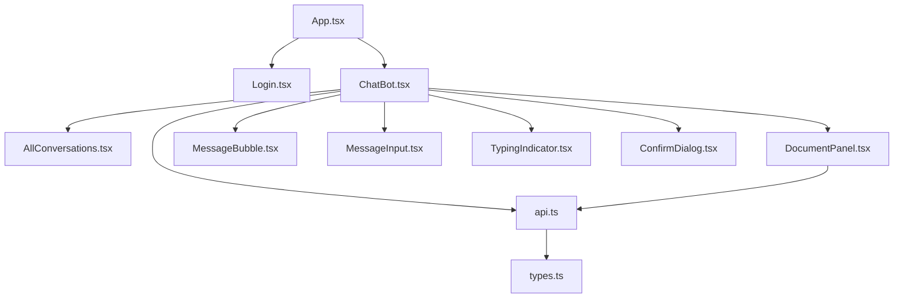

# Frontend Documentation

React 18 + TypeScript frontend for the AI chatbot. Provides chat UI, conversation history, user authentication, and a RAG document panel that supports file uploads and URL ingestion.

## Architecture


```mermaid
graph TB
    APP[App.tsx]
    LOGIN[Login.tsx]
    CHATBOT[ChatBot.tsx]
    SIDEBAR[AllConversations.tsx]
    DOCPANEL[DocumentPanel.tsx]
    MESSAGES[MessageBubble.tsx]
    INPUT[MessageInput.tsx]
    TYPING[TypingIndicator.tsx]
    CONFIRM[ConfirmDialog.tsx]
    API[api.ts]
    TYPES[types.ts]

    APP --> LOGIN
    APP --> CHATBOT
    CHATBOT --> SIDEBAR
    CHATBOT --> DOCPANEL
    CHATBOT --> MESSAGES
    CHATBOT --> INPUT
    CHATBOT --> TYPING
    CHATBOT --> CONFIRM
    CHATBOT --> API
    DOCPANEL --> API
    API --> TYPES
```

## Components

### `App.tsx`
Root component. Shows `Login` when no token is in localStorage, otherwise renders `ChatBot`.

### `ChatBot.tsx`
Main chat interface. Manages:
- Active conversation state
- Message send/receive via `api.sendMessage()`
- Sidebar (conversation list) and document panel integration
- Auto-scroll, typing indicator, rich markdown rendering

### `DocumentPanel.tsx`
Collapsible panel in the sidebar for the RAG knowledge base.

**File mode** — upload PDF or TXT files via multipart form.  
**URL mode** — paste any `https://` URL; the backend fetches and embeds the page.

Features:
- File / URL tab toggle
- Global checkbox (document visible to all users when checked)
- Document list with 🔗 prefix for URLs, 🔒/🌐 scope indicator
- Per-document delete button

### `AllConversations.tsx`
Sidebar conversation list. Auto-refreshes every 30 seconds. Click to load, hover for delete button with confirmation dialog.

### `MessageBubble.tsx`
Renders individual messages with role-based styling. Assistant messages are rendered as Markdown with:
- Syntax-highlighted code blocks (`react-syntax-highlighter`)
- Tables (`remark-gfm`)
- Math equations (`katex` + `rehype-katex`)

### `MessageInput.tsx`
Auto-resizing textarea. Enter to send, Shift+Enter for newline. Disabled while waiting for AI response.

### `Login.tsx`
Register and login forms. Stores JWT in `localStorage` on success.

## API Client (`api.ts`)

All backend calls go through the `api` object. Auth token is read from `localStorage` and attached as `Authorization: Bearer <token>`.

| Method | Endpoint | Purpose |
|--------|----------|---------|
| `register()` | `POST /auth/register` | Create account |
| `login()` | `POST /auth/login` | Get JWT |
| `getCurrentUser()` | `GET /auth/me` | Verify token |
| `sendMessage()` | `POST /chat` | Chat with AI |
| `getUserConversations()` | `GET /conversations` | Sidebar list |
| `getFullConversation()` | `GET /conversations/{id}/full` | Load history |
| `deleteConversation()` | `DELETE /conversations/{id}` | Remove chat |
| `uploadDocument()` | `POST /documents/upload` | File RAG |
| `addUrlDocument()` | `POST /documents/upload-url` | URL RAG |
| `getDocuments()` | `GET /documents` | List docs |
| `deleteDocument()` | `DELETE /documents/{id}` | Remove doc |

## TypeScript Types (`types.ts`)

```typescript
interface Message {
  id?: number;
  role: 'user' | 'assistant';
  content: string;
  conversation_id?: number;
  created_at?: string;
}

interface ConversationSummary {
  id: number;
  user_id: string;
  created_at: string;
  message_count: number;
  last_message_at: string | null;
  preview: string;
}

interface Document {
  id: number;
  user_id: number;
  filename: string;       // URL string for url-type docs
  file_type: string;      // 'pdf' | 'txt' | 'url'
  chunk_count: number;
  is_global: boolean | number;
  created_at: string;
}
```

## Project Structure

```
frontend/src/
├── components/
│   ├── ChatBot.tsx           # Main chat layout
│   ├── DocumentPanel.tsx     # RAG file + URL panel
│   ├── MessageBubble.tsx     # Rich message renderer
│   ├── MessageInput.tsx      # Auto-resize textarea
│   ├── AllConversations.tsx  # Sidebar history
│   ├── TypingIndicator.tsx   # Animated dots
│   ├── LoadingDots.tsx       # Loading animation
│   ├── Login.tsx             # Auth forms
│   └── ConfirmDialog.tsx     # Delete confirmation
├── styles/
│   ├── DocumentPanel.css
│   └── ...
├── api.ts                    # All HTTP calls
├── types.ts                  # Shared TypeScript types
├── App.tsx                   # Root component
└── index.tsx                 # React entry point
```

## Setup

```bash
npm install
npm start       # dev server at http://localhost:3000
npm run build   # production build
```

The frontend connects to the backend at `http://localhost:8000` by default. Override with the `REACT_APP_API_URL` environment variable.
