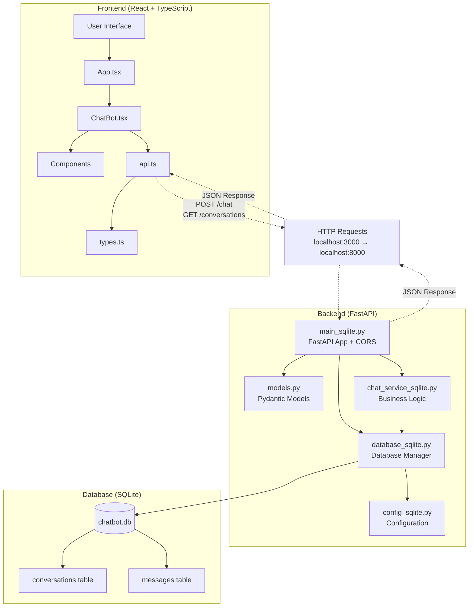
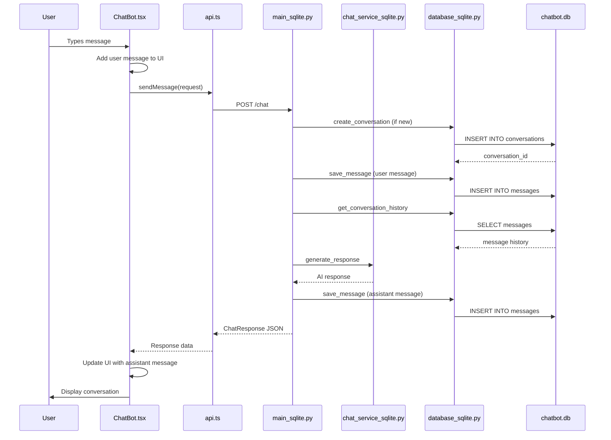
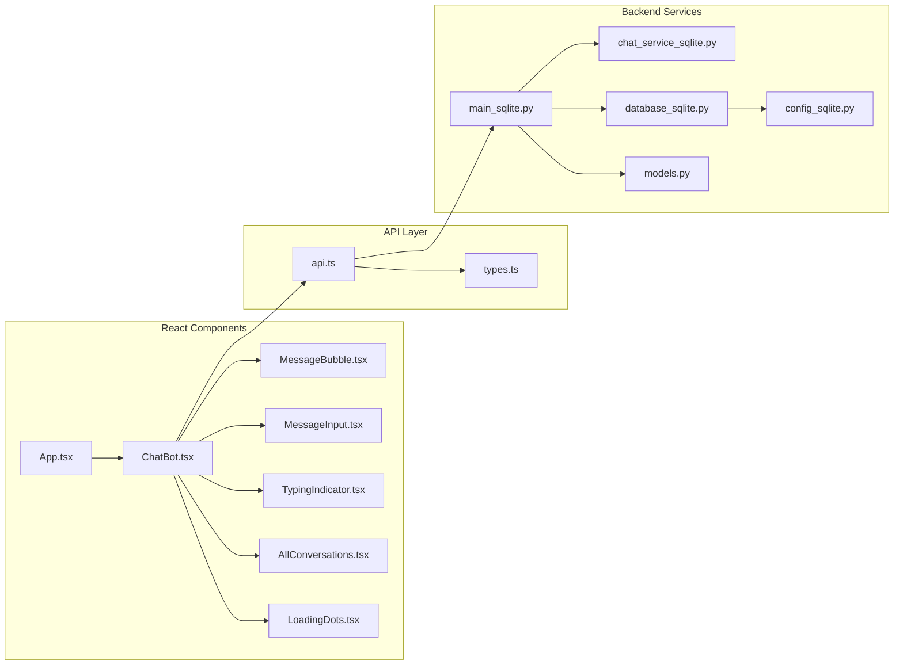
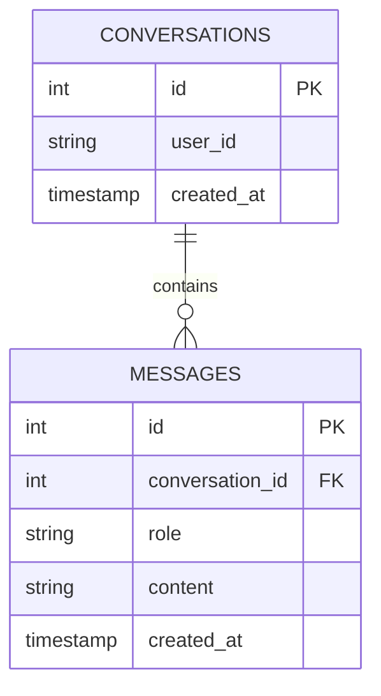

# FastAPI-React Chatbot Application

## Application Architecture

This is a full-stack chatbot application built with FastAPI (backend) and React (frontend) using SQLite as the database.

## Application Flow Diagram



## Detailed Component Flow



## Component Architecture



## Database Schema



## Project Structure

```
FastAPI-React/
├── backend/
│   ├── main_sqlite.py       # FastAPI application entry point
│   ├── models.py           # Pydantic models for request/response
│   ├── database_sqlite.py  # SQLite database manager
│   ├── chat_service_sqlite.py  # Chat service logic
│   ├── config_sqlite.py    # Configuration settings
│   └── requirements_sqlite.txt # Python dependencies
└── frontend/
    ├── src/
    │   ├── App.tsx         # Main React component
    │   ├── api.ts          # API client functions
    │   ├── types.ts        # TypeScript type definitions
    │   └── components/     # React components
    │       ├── ChatBot.tsx
    │       ├── MessageBubble.tsx
    │       ├── MessageInput.tsx
    │       ├── TypingIndicator.tsx
    │       ├── AllConversations.tsx
    │       └── LoadingDots.tsx
    └── package.json        # Node.js dependencies
```

## Key Components

### Backend (FastAPI)

1. **main_sqlite.py**: The main FastAPI application with CORS middleware and API endpoints
2. **database_sqlite.py**: SQLite database connection and CRUD operations
3. **chat_service_sqlite.py**: Business logic for chat functionality
4. **models.py**: Pydantic models for data validation

### Frontend (React + TypeScript)

1. **App.tsx**: Main application component
2. **api.ts**: HTTP client for backend communication
3. **ChatBot.tsx**: Main chat interface component
4. **MessageBubble.tsx**: Individual message display
5. **MessageInput.tsx**: User input component

## Data Flow

1. User types message in React frontend
2. Frontend sends HTTP POST request to FastAPI backend
3. Backend processes message and stores in SQLite database
4. Backend returns response to frontend
5. Frontend displays the conversation

## API Endpoints

- `POST /chat`: Send a message and get response
- `GET /conversations/user/{user_id}`: Get user's conversations
- `POST /conversations`: Create new conversation
- `GET /conversations/{conversation_id}/messages`: Get conversation messages

## Technology Stack

- **Frontend**: React, TypeScript, CSS
- **Backend**: FastAPI, Python, Pydantic
- **Database**: SQLite
- **Communication**: HTTP/REST API with JSON
- **Development**: Node.js (frontend), Python (backend)
