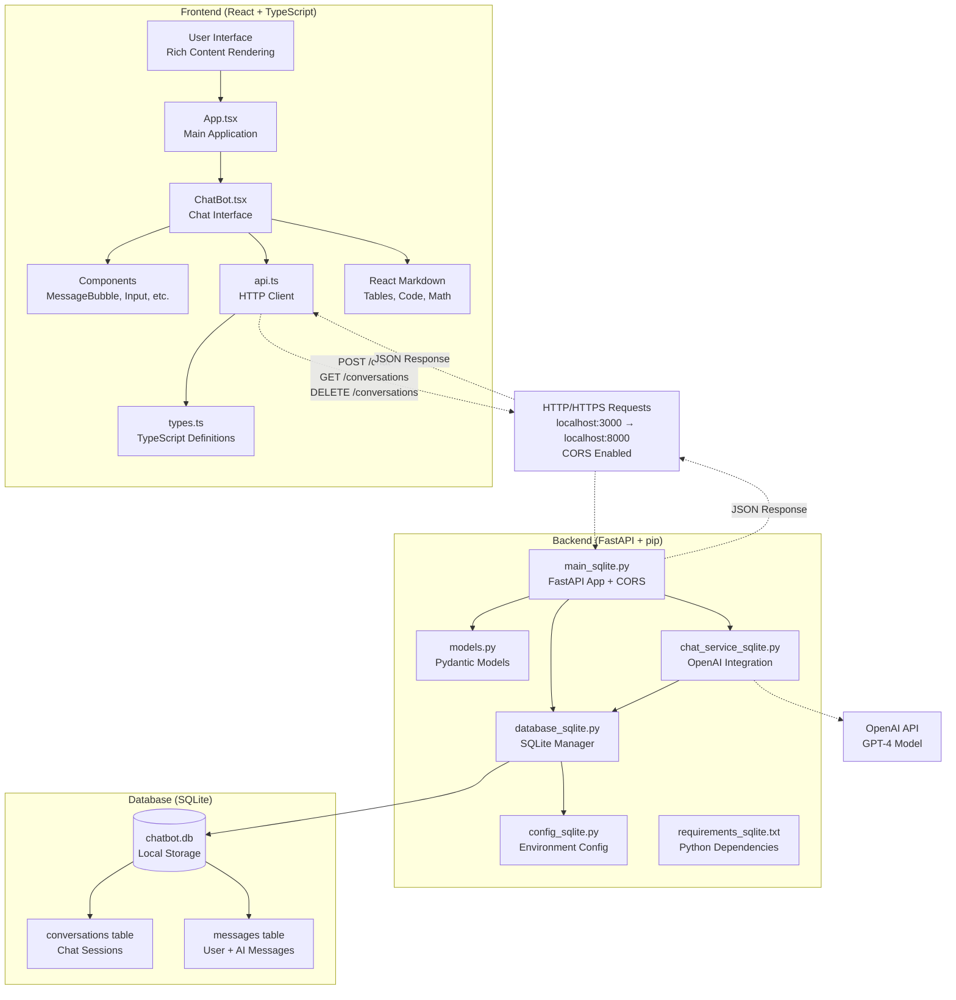
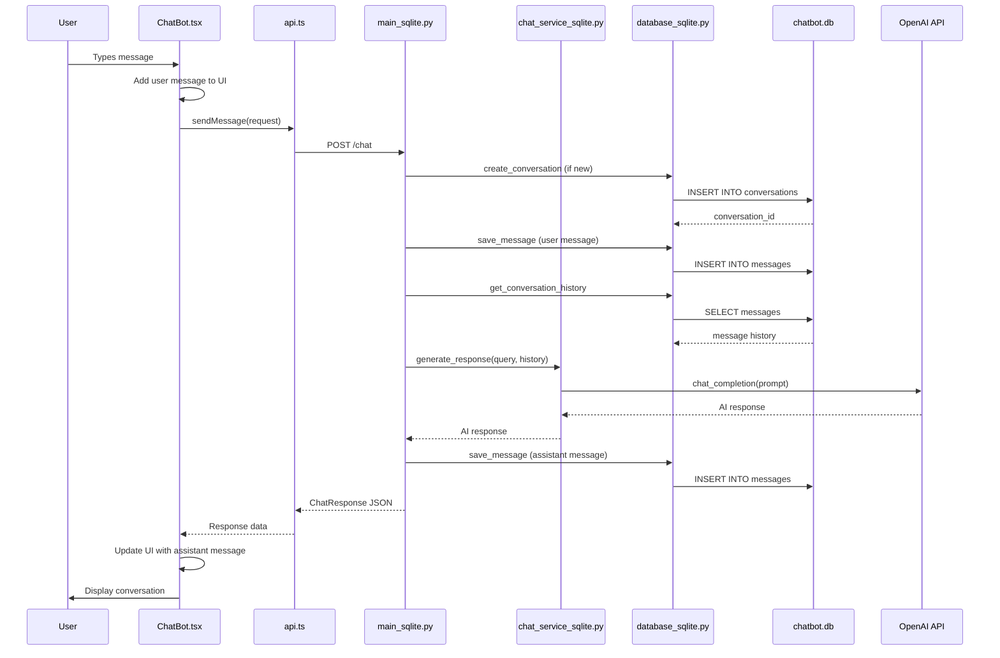
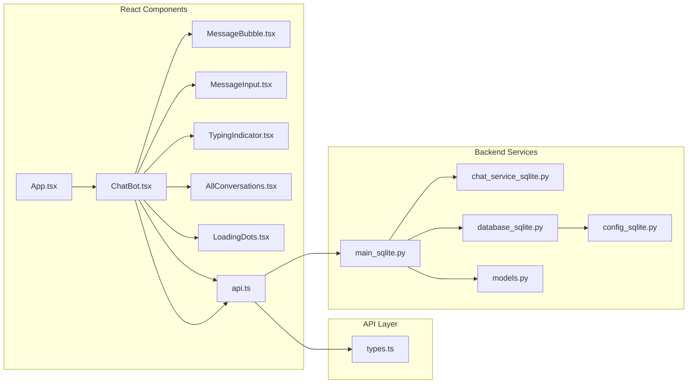
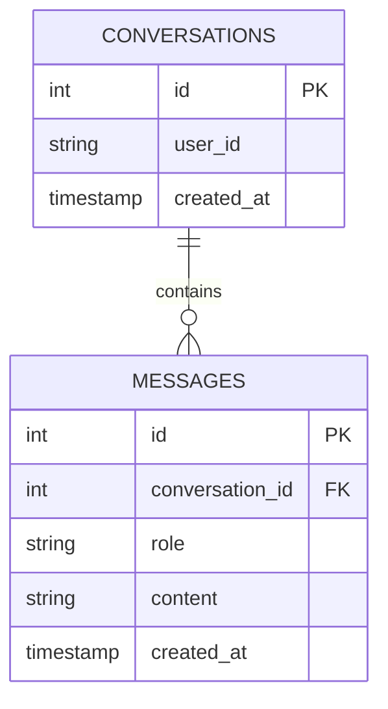
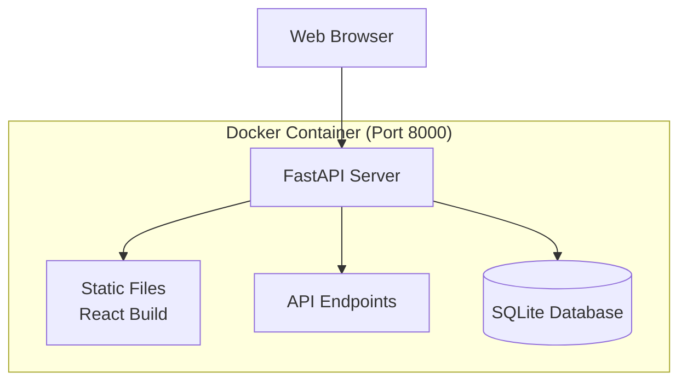
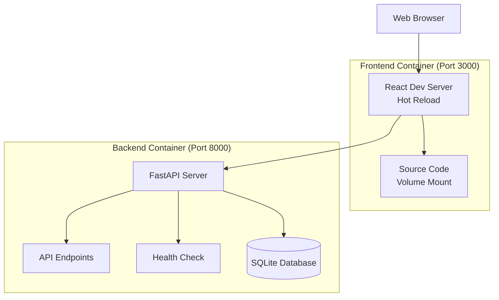

# 🚀 FastAPI-React TypeScript Chatbot - Full Stack Architecture

## 🌟 Application Overview

This is a modern full-stack AI chatbot application built with FastAPI (backend) and React TypeScript (frontend). The application supports real-time chat, conversation management, and user authentication using SQLite for data persistence and pip for dependency management.

## ✨ Key Features

### Core Features
- 💬 **Real-time Chat** - Instant messaging with AI assistant
- 📚 **Conversation Management** - Persistent chat history
- 🔐 **User Authentication** - Secure JWT-based login system
- 📱 **Responsive Design** - Works on all devices

### Technical Features
- 🏗️ **Modern Architecture** - FastAPI + React + TypeScript
- � **Virtual Environment** - Clean Python dependency management with pip  
- 🚀 **One-command Setup** - Simple deployment
- 📊 **Rich Content** - Tables, code blocks, math equations
- 🐳 **Docker Support** - Full containerization with Docker Compose
- 🔧 **Health Monitoring** - Built-in health checks and status endpoints
- 📊 **Static File Integration** - Seamless frontend-backend integration

## 🏗️ Application Flow Diagram



## Detailed Component Flow



## Component Architecture



## Database Schema



## Project Structure

```
FastAPI-React/
├── backend/
│   ├── main_sqlite.py       # FastAPI application entry point
│   ├── models.py           # Pydantic models for request/response
│   ├── database_sqlite.py  # SQLite database manager
│   ├── chat_service_sqlite.py  # Chat service logic
│   ├── config_sqlite.py    # Configuration settings
│   └── requirements_sqlite.txt # Python dependencies
└── frontend/
    ├── src/
    │   ├── App.tsx         # Main React component
    │   ├── api.ts          # API client functions
    │   ├── types.ts        # TypeScript type definitions
    │   └── components/     # React components
    │       ├── ChatBot.tsx
    │       ├── MessageBubble.tsx
    │       ├── MessageInput.tsx
    │       ├── TypingIndicator.tsx
    │       ├── AllConversations.tsx
    │       └── LoadingDots.tsx
    └── package.json        # Node.js dependencies
```

## Key Components

### Backend (FastAPI)

1. **main_sqlite.py**: The main FastAPI application with CORS middleware and API endpoints
2. **database_sqlite.py**: SQLite database connection and CRUD operations
3. **chat_service_sqlite.py**: Business logic for chat functionality
4. **models.py**: Pydantic models for data validation

### Frontend (React + TypeScript)

1. **App.tsx**: Main application component
2. **api.ts**: HTTP client for backend communication
3. **ChatBot.tsx**: Main chat interface component
4. **MessageBubble.tsx**: Individual message display
5. **MessageInput.tsx**: User input component

## Data Flow

1. User types message in React frontend
2. Frontend sends HTTP POST request to FastAPI backend
3. Backend processes message and stores in SQLite database
4. Backend returns response to frontend
5. Frontend displays the conversation

## API Endpoints

- `POST /chat`: Send a message and get response
- `GET /conversations/user/{user_id}`: Get user's conversations
- `POST /conversations`: Create new conversation
- `GET /conversations/{conversation_id}/messages`: Get conversation messages

## 🐳 Docker Deployment Architecture

### Deployment Modes

#### Production Mode


#### Development Mode


### Docker Services Configuration

```yaml
# compose.yml
services:
  backend:
    build: .
    ports:
      - "8000:8000"
    environment:
      - OPENAI_API_KEY=${OPENAI_API_KEY}
    healthcheck:
      test: ["CMD", "curl", "-f", "http://localhost:8000/health"]
      interval: 30s
      timeout: 10s
      retries: 3

  frontend-dev:
    build:
      context: .
      target: frontend-dev
    ports:
      - "3000:3000"
    profiles:
      - dev
    volumes:
      - "./frontend/src:/app/src"
```

### Container Health Monitoring

- **Backend Health**: `/health` endpoint with database connectivity check
- **Frontend Health**: Development server status and compilation success
- **Docker Health Checks**: Built-in container monitoring with automatic restarts

## Technology Stack

- **Frontend**: React, TypeScript, CSS
- **Backend**: FastAPI, Python, Pydantic
- **Database**: SQLite
- **Communication**: HTTP/REST API with JSON
- **Development**: Node.js (frontend), Python (backend)
- **Containerization**: Docker, Docker Compose
- **Health Monitoring**: Built-in health checks and status endpoints
- **Deployment**: Multi-stage builds with development and production profiles

## Quick Start

### Docker Deployment (Recommended)
```bash
# Production mode
git checkout docker
docker-compose up -d

# Development mode  
docker-compose --profile dev up -d

# Access application
open http://localhost:8000  # Production
open http://localhost:3000  # Development
```

### Local Development
```bash
# Backend
cd backend
python -m venv .venv
source .venv/bin/activate
pip install -r requirements_sqlite.txt
uvicorn main_sqlite:app --reload

# Frontend  
cd frontend
npm install
npm start
```
