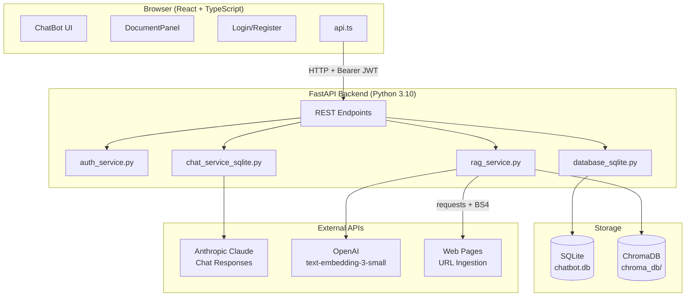
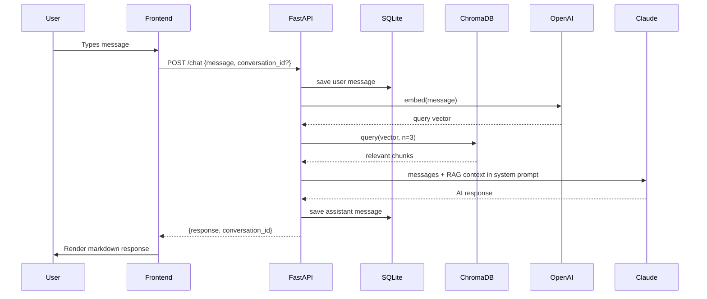
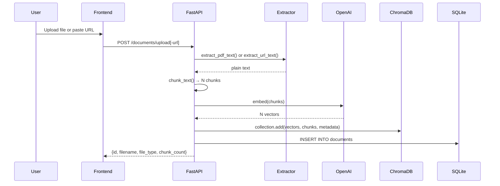
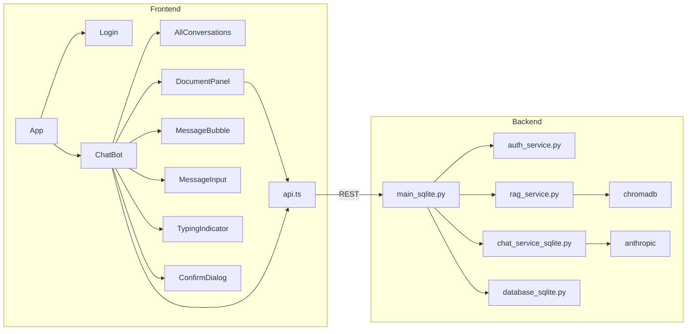
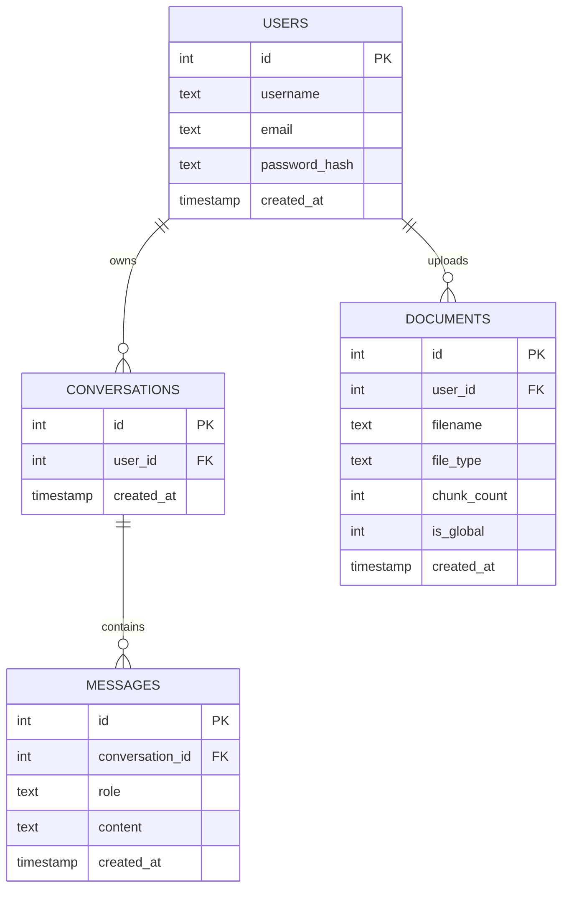

# Full Stack Architecture

## Application Overview

Full-stack AI chatbot with JWT authentication, persistent SQLite storage, and Retrieval-Augmented Generation (RAG). Users can chat with Claude AI and optionally upload documents (PDF, TXT) or paste website URLs to augment responses with private knowledge.

## System Architecture


```mermaid
graph TB
    subgraph "Browser (React + TypeScript)"
        UI[ChatBot UI]
        DOC[DocumentPanel]
        AUTH_UI[Login/Register]
        API_CLIENT[api.ts]
    end

    subgraph "FastAPI Backend (Python 3.10)"
        ENDPOINTS[REST Endpoints]
        AUTH_SVC[auth_service.py]
        CHAT_SVC[chat_service_sqlite.py]
        RAG_SVC[rag_service.py]
        DB_MGR[database_sqlite.py]
    end

    subgraph "Storage"
        SQLITE[(SQLite\nchatbot.db)]
        CHROMA[(ChromaDB\nchroma_db/)]
    end

    subgraph "External APIs"
        CLAUDE[Anthropic Claude\nChat Responses]
        OPENAI_EMB[OpenAI\ntext-embedding-3-small]
        WEB[Web Pages\nURL Ingestion]
    end

    API_CLIENT -->|HTTP + Bearer JWT| ENDPOINTS
    ENDPOINTS --> AUTH_SVC
    ENDPOINTS --> CHAT_SVC
    ENDPOINTS --> RAG_SVC
    ENDPOINTS --> DB_MGR

    DB_MGR --> SQLITE
    RAG_SVC --> CHROMA
    CHAT_SVC --> CLAUDE
    RAG_SVC --> OPENAI_EMB
    RAG_SVC -->|requests + BS4| WEB
```

## Request Flow — Chat with RAG


```mermaid
sequenceDiagram
    participant User
    participant Frontend
    participant FastAPI
    participant SQLite
    participant ChromaDB
    participant OpenAI
    participant Claude

    User->>Frontend: Types message
    Frontend->>FastAPI: POST /chat {message, conversation_id?}
    FastAPI->>SQLite: save user message
    FastAPI->>OpenAI: embed(message)
    OpenAI-->>FastAPI: query vector
    FastAPI->>ChromaDB: query(vector, n=3)
    ChromaDB-->>FastAPI: relevant chunks
    FastAPI->>Claude: messages + RAG context in system prompt
    Claude-->>FastAPI: AI response
    FastAPI->>SQLite: save assistant message
    FastAPI-->>Frontend: {response, conversation_id}
    Frontend->>User: Render markdown response
```

## RAG Ingestion Flow


```mermaid
sequenceDiagram
    participant User
    participant Frontend
    participant FastAPI
    participant Extractor
    participant OpenAI
    participant ChromaDB
    participant SQLite

    User->>Frontend: Upload file or paste URL
    Frontend->>FastAPI: POST /documents/upload[-url]
    FastAPI->>Extractor: extract_pdf_text() or extract_url_text()
    Extractor-->>FastAPI: plain text
    FastAPI->>FastAPI: chunk_text() → N chunks
    FastAPI->>OpenAI: embed(chunks)
    OpenAI-->>FastAPI: N vectors
    FastAPI->>ChromaDB: collection.add(vectors, chunks, metadata)
    FastAPI->>SQLite: INSERT INTO documents
    FastAPI-->>Frontend: {id, filename, file_type, chunk_count}
```

## Component Map


```mermaid
graph LR
    subgraph Frontend
        App --> Login
        App --> ChatBot
        ChatBot --> AllConversations
        ChatBot --> DocumentPanel
        ChatBot --> MessageBubble
        ChatBot --> MessageInput
        ChatBot --> TypingIndicator
        ChatBot --> ConfirmDialog
        DocumentPanel --> api.ts
        ChatBot --> api.ts
    end

    subgraph Backend
        main_sqlite.py --> auth_service.py
        main_sqlite.py --> chat_service_sqlite.py
        main_sqlite.py --> rag_service.py
        main_sqlite.py --> database_sqlite.py
        rag_service.py --> chromadb
        chat_service_sqlite.py --> anthropic
    end

    api.ts -->|REST| main_sqlite.py
```

## Database Schema


```mermaid
erDiagram
    USERS {
        int id PK
        text username
        text email
        text password_hash
        timestamp created_at
    }
    CONVERSATIONS {
        int id PK
        int user_id FK
        timestamp created_at
    }
    MESSAGES {
        int id PK
        int conversation_id FK
        text role
        text content
        timestamp created_at
    }
    DOCUMENTS {
        int id PK
        int user_id FK
        text filename
        text file_type
        int chunk_count
        int is_global
        timestamp created_at
    }

    USERS ||--o{ CONVERSATIONS : owns
    CONVERSATIONS ||--o{ MESSAGES : contains
    USERS ||--o{ DOCUMENTS : uploads
```

## ChromaDB Collections

| Collection | Contents |
|-----------|---------|
| `user_{id}` | Personal documents for user with given id |
| `global_docs` | Documents visible to all users |

Each chunk is stored with metadata: `doc_id`, `user_id`, `filename`.

## Project Structure

```
fastapi-react-typescript-chatbot/
├── backend/
│   ├── main_sqlite.py          # FastAPI app, all endpoints
│   ├── models.py               # Pydantic models
│   ├── database_sqlite.py      # SQLite CRUD
│   ├── auth_service.py         # JWT auth
│   ├── chat_service_sqlite.py  # Claude integration
│   ├── rag_service.py          # ChromaDB + embeddings + URL fetch
│   ├── config_sqlite.py        # Env settings
│   ├── requirements_sqlite.txt
│   └── pyproject.toml
├── frontend/
│   └── src/
│       ├── components/
│       │   ├── ChatBot.tsx
│       │   ├── DocumentPanel.tsx   # File + URL RAG
│       │   ├── AllConversations.tsx
│       │   ├── MessageBubble.tsx
│       │   ├── MessageInput.tsx
│       │   ├── Login.tsx
│       │   ├── TypingIndicator.tsx
│       │   ├── LoadingDots.tsx
│       │   └── ConfirmDialog.tsx
│       ├── api.ts
│       ├── types.ts
│       └── App.tsx
├── test/
│   ├── conftest.py             # Fixtures, mocked ChromaDB
│   ├── test_auth.py            # 11 tests
│   ├── test_chat.py            # 7 tests
│   ├── test_conversations.py   # 11 tests
│   └── test_rag.py             # 20 tests (file + URL)
├── pytest.ini
└── docker-compose.yml
```

## Environment Variables

```env
ANTHROPIC_API_KEY=     # Claude chat
OPENAI_API_KEY=        # RAG embeddings
SECRET_KEY=            # JWT signing
ACCESS_TOKEN_EXPIRE_MINUTES=30
```
